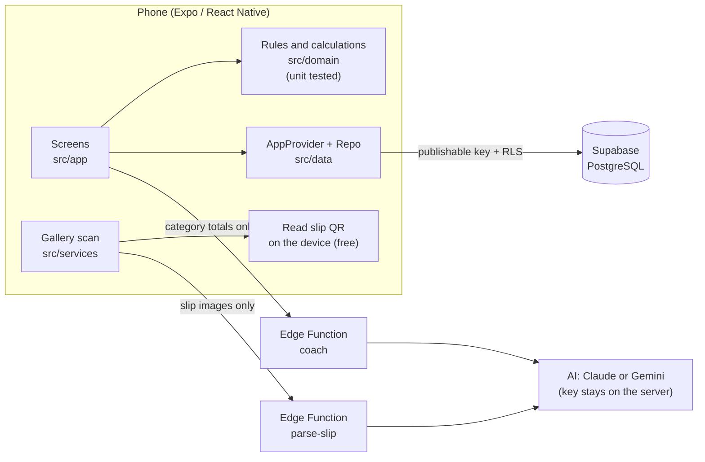

**English** | [ภาษาไทย](README.md)

# MindPay

A personal finance app for university students and first jobbers. It does more than "record what you spent": it tells you **how many more days your money will last**, and helps you think **before** you pay.

Course: Introduction to Software Engineering (15031001) · Team 13. Socrates and Skeletons

> **Origin of this repository:** The code was moved from the team's original repository [2550expo-tech/Socrates-and-Skeletons-](https://github.com/2550expo-tech/Socrates-and-Skeletons-), which keeps the development history from 27 Sep 2026. It was then split into 5 packages by FR, and each member committed the part they are responsible for. The links under "Try it" are the web app and APK from the original repository.

## Who did what (`fr/` folder)

| Package | Work | Owner's README |
|---|---|---|
| 1 | FR-1 Transactions · FR-2 Overview | [FR-1](fr/FR-1-transactions/README.md) · [FR-2](fr/FR-2-overview/README.md) |
| 2 | FR-3 Voice Entry + user accounts + Design System | [FR-3](fr/FR-3-voice/README.md) |
| 3 | FR-4 Slip Scanning + browser test suite | [FR-4](fr/FR-4-slip/README.md) |
| 4 | FR-5 Nong Kla coach + skins, missions, Halloween | [FR-5](fr/FR-5-coach/README.md) |
| 5 | FR-6 Money Runway + app shell, project setup, CI | [FR-6](fr/FR-6-runway/README.md) |

Each FR README is written in Thai. Function names, file names and test IDs (TC-xx) are in English and match the code.

---

## Try it

| Where | Link |
|---|---|
| 💻 Web (computer / iPhone / any phone) | https://2550expo-tech.github.io/Socrates-and-Skeletons-/ |
| 🤖 Android app (.apk) | https://github.com/2550expo-tech/Socrates-and-Skeletons-/releases/tag/latest-apk |

Both update automatically on every push to `main`. The web version can do everything except scan the whole photo gallery (use "Choose slip photo" instead).

## Functional Requirements (5 from the M1 Team Charter + FR-3 Voice)

| FR | Feature | In the app |
|---|---|---|
| FR-1 | Transaction Management: add, edit, categorize, delete | **Transactions** tab, transaction form |
| FR-2 | Overview Dashboard: income, expenses, balance, totals by category | **Home** tab |
| FR-3 | Voice Entry: say "ข้าว 50 บาท" (rice, 50 baht) and it is recorded (several items in one sentence, income, "yesterday") | Gold mic button on **Home** (added 29 Sep at the users' request) |
| FR-4 | Automatic Gallery Slip Detection: finds bank slips in the gallery, 80% confidence threshold, blocks duplicates | **Automatic every time the app opens** + gold **Scan slips** button |
| FR-5 | AI Coach **Nong Kla (น้องกล้า)**: a large mascot that moves its mouth and gestures while talking, speaks aloud in a calm and friendly voice, and explains confirmed data (replaces the earlier 3-tone coach, at the users' request on 29 Sep) | **Coach** tab |
| FR-6 | Money Runway: estimates the date the balance reaches the user's low line, from the 7-day average | **Runway (เงินพอถึง)** tab |

The full FR → code → test mapping is in [`docs/TRACEABILITY.md`](docs/TRACEABILITY.md).

## Architecture



- **Money is stored in satang (integers)**, so there are no decimal rounding errors.
- **All times use Thailand time (UTC+7)**, both for grouping by day and for reading dates on slips.
- **A slip that has been read is a "draft"** until the user confirms it. It does not change the balance before that.
- **The AI API key (Claude or Gemini) is only on the server.** The app contains no secret keys.

## Folder structure

```
src/
  app/            Screens (Expo Router: one file = one screen)
    (tabs)/       Home, Transactions, Runway, Coach
    scan.tsx      FR-4 slip scanning
    transaction.tsx  FR-1 add / edit / delete / review drafts
  domain/         All rules (pure TypeScript, no UI) + __tests__
  data/           Supabase client, Repo (cloud / demo), AppProvider
  services/       Gallery, slip reading, coach
  ui/             Design system: theme, components, charts, money tree (rules in docs/DESIGN_SYSTEM.md)
supabase/
  migrations/     SQL that creates the tables + RLS
  functions/      parse-slip, coach (Deno)
docs/             Traceability, AI usage log, Design System
```

---

## Getting started

### Requirements
- Node.js 22 or newer
- An Android phone (recommended) or an iPhone
- A free Expo account, if you want to build the .apk file

### 1. Install

```bash
git clone https://github.com/2550expo-tech/Socrates-and-Skeletons-.git
cd Socrates-and-Skeletons-
npm install
cp .env.example .env
```

`.env.example` already contains the team's Supabase project values. They are public keys and are safe to ship in the app, because the database is protected by RLS.

### 2. Quickest way to try it: Expo Go (for developers)

Expo Go is a helper app for development. Our app runs inside Expo Go, so the phone shows the name Expo Go. To get the **MindPay** app with its own icon and name, use step 3.

1. Install **Expo Go** from the Play Store / App Store.
2. Run `npx expo start` and scan the QR code in the terminal with Expo Go.
3. Choose one of two ways in: **Sign up** (real data on Supabase) or **Try with sample data** (data stays on the phone).

> On Android, Expo Go may not get full access to the gallery because of Google's policy. If the gallery scan finds no photos, use "Choose photo" or build the .apk in step 3.

### 3. Install the real MindPay app on Android (.apk)

**Easiest: download the ready-made file**
On every push to `main`, GitHub builds the APK automatically (`.github/workflows/android-apk.yml`). It takes about 15–25 minutes.
Open this page on an Android phone → tap `mind-pay.apk` → install:
https://github.com/2550expo-tech/Socrates-and-Skeletons-/releases/tag/latest-apk

This file is signed with a debug key. It is fine for testing and presenting, but it is not a Play Store release.

**Or build it yourself with EAS (Expo account)**

```bash
npx eas-cli@latest login
npx eas-cli@latest build --profile preview --platform android
```

Wait about 10–20 minutes. EAS gives you a link to download the `.apk`; open it on the phone to install (no Google developer account needed). You get an app named **MindPay** with the money-tree icon.

The icons are made by `scripts/make_icons.py`. If the team has an official logo, replace the files in `assets/` (icon.png 1024×1024, no transparent background).

### Updating installed apps (EAS Update)

Installed Android apps download new code by themselves when opened, and use the new version the next time they are opened. No new APK is needed.
- Runs from `.github/workflows/eas-update.yml` on every push to `main` (needs the `EXPO_TOKEN` secret in GitHub).
- Expo project: `@expokler/mindpay` · channel: `production`
- If you add a package with native code or change native settings in `app.json`, increase `version` in `app.json` (e.g. 1.0.0 → 1.1.0) and install the new APK once.

### 4. Set up the AI (slip reading + coach)

Supabase Dashboard → **Edge Functions → Secrets** → add **one of these** (you can add both; Claude is used first):

| Name | Value | Notes |
|---|---|---|
| `GEMINI_API_KEY` (or `GOOGLE_API_KEY`) | Key from https://aistudio.google.com/apikey · the name must match exactly, in capitals, and go in **Edge Functions → Secrets** (not Vault and not Supabase's API keys page) | **Free, no card needed.** On the free tier Google may use the data sent (slip images) to improve its models, and there are per-minute / per-day limits. Good for testing and presenting. |
| `ANTHROPIC_API_KEY` | Key from console.anthropic.com (`sk-ant-...`) | Needs credit and identity verification. Data is not used to train models. |

No redeploy is needed after adding a key.

Optional settings:
- `AI_PROVIDER` = `claude` or `gemini` to force one provider
- `GEMINI_MODEL` (default `gemini-3.5-flash-lite`; if it is not available, the next model is tried automatically)
- `SLIP_MODEL`, `COACH_MODEL` for Claude (default `claude-haiku-4-5-20251001`)
- `SLIP_DAILY_LIMIT` (300 slips/day/user), `COACH_DAILY_LIMIT` (60 questions/day/user)

Estimated cost: Gemini free tier ฿0 (within its limits) · Claude ≈ US$0.003 per slip (about 10 satang).
If the AI does not answer in time (free-tier limit reached), the app asks the user to try again, and the remaining slips are read the next time the app opens.

---

### 5. Set up sign-up / sign-in

Set the Site URL and Redirect URLs, and choose whether email confirmation is required. Steps and the email template (6-digit code) are in [docs/SUPABASE_AUTH_SETUP.md](docs/SUPABASE_AUTH_SETUP.md).

> Supabase's free email service only sends to email addresses of team members in the project, and only 2 emails per hour. During class or presentations we recommend turning off Confirm email.

---

## Developer commands

```bash
npm test            # unit tests for all rules (157 cases, including text contrast for every theme)
npm run e2e:web     # 145 browser checks: sign-up/sign-in, automatic slip scan on app open (simulated gallery), slip scanning, slips waiting for review, add/edit/delete transactions, add income, voice entry (simulated speech recognizer), check before you spend, Nong Kla coach, skins and missions, color themes, Halloween theme (catching ghosts / candies / skins), crossing midnight, animations (first time: npx playwright install chromium)
npm run demo:video  # records demo videos (sign up → set up money → slips read on app open, Android style → home → runway → coach) in light/dark + web, into demo-video/, with simulated data, never touching real accounts (run e2e:web first to create dist/)
npm run typecheck   # TypeScript check
npx expo lint       # ESLint
npx expo start      # start the dev server
```

### Animations and effects (`src/ui/effects.tsx`)

Available: parts appear one by one (`Reveal`), buttons/cards bounce when pressed (`usePressSpring`), a light sweep across gold cards (`Shine`), aurora light (`Aurora`), sparkles (`Sparkles`), pulsing ring (`PulseRing`), growing chart bars (`GrowBar`), coach typing dots (`TypingDots`), text typed letter by letter (`Typewriter`), slip scanning beam (`ScanBeam`), and gold coin / leaf confetti (`useCelebrate`) after signing up, finishing setup, finding slips and confirming a slip.

Rules every effect must follow:
- Only animate transform and opacity, using the native driver on phones, so it stays smooth even on low-cost phones.
- Every effect stops by itself. Nothing keeps moving while the user is idle (saves battery). A browser test checks that the home screen is still within 9 seconds. The exceptions are scanning, and the large Nong Kla (coach, skins, welcome screens), which breathes and blinks gently only while that screen is open (transform on the native driver, so it uses little battery).
- If "Reduce motion" is on in the phone, everything appears immediately without movement.
- No new native modules (only Animated, react-native-svg and expo-linear-gradient, which are already installed), so installed apps can get these updates over the air without a new APK.

### Voice entry (FR-3) and apps already installed

Speech recognition in the app uses `expo-speech-recognition`, which is a new native module, so the new APK (release `latest-apk`) is needed before the mic can be used. Older apps that received the OTA update show the same screen with a text box instead (you can also tap the mic on the keyboard and speak), because the module is loaded as optional (`requireOptionalNativeModule`) and the app does not crash. On the web it uses the browser's Web Speech API (Chrome/Edge/Safari).

### Nong Kla: the talking coach, skins and money missions

- **Coach** (`src/app/(tabs)/coach.tsx`): a large Nong Kla on a stage, drawn in code with soft shading (`src/ui/kla/art.tsx`) and split into parts (body, arms, head, eyes, mouth). Each part turns around its own joint on the native driver, so motion is smooth: it breathes, sways, blinks and tilts its head, and while talking its mouth moves with the syllables, its hands point and its head nods (`src/ui/kla/KlaStage.tsx`). It only moves while the coach screen is open, and stops when "Reduce motion" is on.
- **Voice** (`src/ui/kla/useKlaTalk.ts`, `src/services/tts.ts`, `tts.web.ts`): answers are cut into short subtitles (`src/domain/klaTalk.ts`) and read one by one with the phone's (Google/Apple) or browser's Thai voice, slightly slower and lower to sound calm and friendly. Sound can be turned off on the coach or settings screen. If the device has no Thai voice, Nong Kla still moves its mouth with subtitles timed for reading.
- **Voice on Android needs the new APK** because it uses `expo-speech` (a new native module). Older apps that received OTA updates show Nong Kla talking in subtitles without sound (the module is loaded as optional, so it does not crash).
- **Skin collection** (`src/app/skins.tsx`, rules in `src/domain/skins.ts`): 19 outfits, earned from 8 money missions on the achievements screen (`src/domain/missions.ts`, e.g. open the app 30 days in a row → Thai outfit) and limited skins given only during certain periods. After the period ends they show "Limited skin · time is over, no longer available". The chosen outfit appears everywhere Nong Kla appears. Skin and app-open data are stored on the phone (`src/services/kla.ts`).
- **Halloween theme "Spooky Night"** (`src/ui/halloween.tsx`, rules in `src/domain/halloween.ts`): choose it in Settings → Color theme (or tap "Turn on Halloween theme" on the invitation card on the home screen during 29 Sep–2 Nov 2026). Dark purple and pumpkin orange, ghost flags on the home screen, bats flying past the balance card, a small ghost peeking from the header corner of every screen, and Halloween-colored confetti. **Catch ghosts for candy**: 3 ghosts a day, 1 candy each, plus 2 candies on days the user records a transaction (counted once a day, so recording many items still gives 2, which avoids encouraging fake entries). Candies unlock **6 limited Halloween skins**: Pumpkin Ghost (free during the event), Little Sheet Ghost 5, Little Witch 12, Mummy 20, Vampire 30, Frankenstein 40 candies. After 2 Nov, skins not yet earned can no longer be collected (skins already earned are kept). Nong Kla greets the user in a spooky-cute way on the coach screen when this theme is on. Every effect moves a few times and then stops, and all of them stop when "Reduce motion" is on.
- **Design System**: all colors, typography, spacing, corner radii and components are summarized in [`docs/DESIGN_SYSTEM.md`](docs/DESIGN_SYSTEM.md), with a checklist for adding new screens. Take a screenshot of any theme with `node scripts/theme-shot.mjs <path> 0 <name> dark <theme>`.
- **Every screen follows the theme**: buttons, chips, tab bar, cards, notification bars and the web launch animation use the selected theme's colors (no leftover green in other themes). A unit test checks that text in every theme meets WCAG AA contrast (4.5:1) in both light and dark mode. The design approach is based on UX research recorded in `docs/AI_USAGE_LOG.md`, row 19.
- **Icons and splash screen**: `node scripts/kla-icons/make.mjs && python3 scripts/kla-icons/finish.py` draws the app icon, adaptive icon (including Android 13 monochrome), splash screen and web icons from the same Nong Kla drawing used in the app. The mobile app icon and splash change when a new APK is installed; the launch animation and welcome screen change immediately through OTA.

## Setting up a new Supabase project (if moving the project)

1. Create a new project (Region: Singapore).
2. SQL Editor → run the files in `supabase/migrations/` in file-name order.
3. Deploy the functions: `npx supabase functions deploy parse-slip` and `coach`.
4. Add the secret `GEMINI_API_KEY` or `ANTHROPIC_API_KEY`.
5. Update the URL and publishable key in `.env` and `eas.json`.

---

## Security and privacy

- Every table (including `savings_goals`, added 29 Sep) has **Row Level Security** on. Users can only see and change their own rows. Checked with the Supabase Security Advisor: no table issues (the only remaining advice is to turn on Leaked Password Protection in the Auth settings, which the team can do).
- Gallery photos are checked **on the phone first**. Only photos with a bank slip QR code (or screen-sized photos with an e-wallet QR code) are sent to be read, and they are not stored on our server. (The AI provider receives the image to read it. On the free Gemini tier, Google may keep it to improve its models, so use a paid tier or Claude once there are real users.)
- The AI coach (Nong Kla) only receives totals by category: no images, account numbers or names of people. The voice is produced by the phone's or browser's Thai text-to-speech (only the coach's answer is read aloud).
- Names on slips are used to tell income from expenses: the phone keeps only a fingerprint (hash) of names it sees often, not the names themselves, and never sends them anywhere.
- AI calls are limited per account per day to keep costs under control.
- Android asks for photo access, and for microphone access only when the user taps the mic for voice entry. (Speech is turned into text by the phone's or browser's speech recognizer, e.g. Google. The app does not store audio, only the items the user saves.) Camera access is blocked.

## Known limitations

- iPhone: use the web version in Safari → Share → "Add to Home Screen" to get the MindPay icon and full-screen mode, but automatic gallery scanning is not available (choose slip photos yourself). Installing as a native app needs an Apple Developer account (US$99/year) and an EAS build; no Mac is needed.
- Slips with no QR code at all are skipped in saving mode. Turn off "Read only photos with a QR code" or use "Choose photo". (E-wallet slips with their own kind of QR code are already read.)
- Accuracy: every slip is read twice by 2 different AI models. If they disagree, the slip waits for review with both values shown, which greatly reduces errors reaching the balance on their own. No image-reading system can guarantee 100%, though. Amounts confirmed directly by the bank would need a paid slip-verification service connected to banks (team decision).
- The Money Runway estimate does not yet include future income.
- Not yet tested on many phone models. See the test plan in `docs/TRACEABILITY.md`.

## Use of AI in development

Recorded as required by the SRS in [`docs/AI_USAGE_LOG.md`](docs/AI_USAGE_LOG.md).
